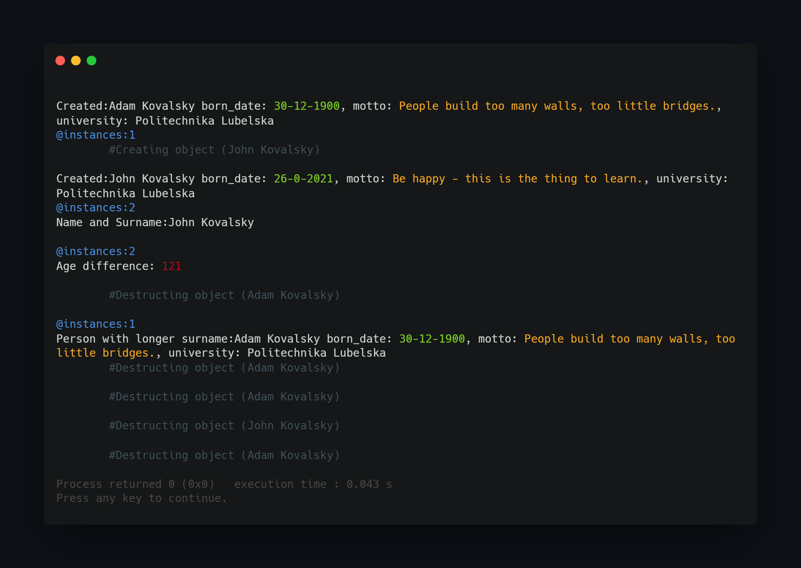

## What project do?
___

Project shows how to use classes inside other classes as fields, operate on two external object inside current class method as attribute.  

Program after execution calls for default constructor creating object Adam and displays its field values. Then create object 2 (John) with overloaded constructor and displays its field values.

Two objects are comapared by age and then surname length.

## How to use?
___
Just import project to CodeBlocks and compile/run. If you wish you could use another environment by using only main.cpp file.

<!--https://banner.godori.dev/-->
<!--https://shields.io/-->
<!--https://carbon.now.sh/-->